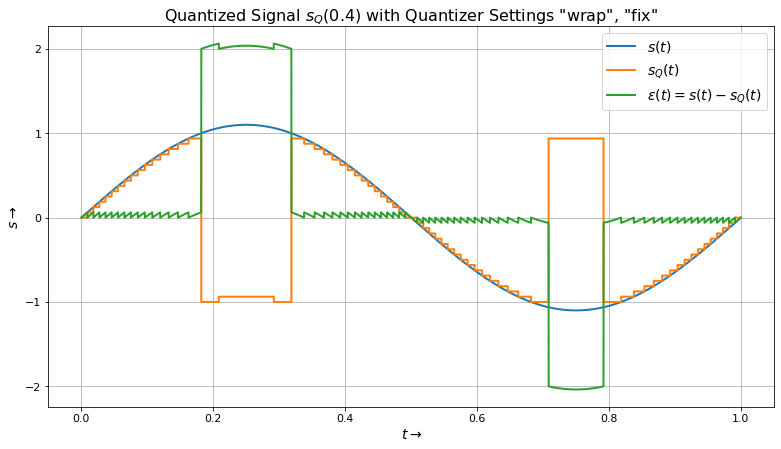

# pyfixp
A fast fixpoint library utilizing numpy.

This library was originally created for the Python Filter Design and Analysis [pyFDA](https://github.org/chipmuenk/pyfda) project but can also be used standalone.

Most routines operate on scalars and arrays alike, currently the following operations are supported:

- (Re)Quantization ('floor', 'round', 'fix')
- Wrap-around or saturation behaviour for overflows
- Conversion of binary, hex, decimal, CSD format strings

## Example
Conversion is controlled with dictionaries, in the following example a quantizer is defined with an output format of 0 integer bits and 3 fractional bits, overflows are wrapped around in two's complement style ("wrap") and additional fractional bits are simply truncated ("floor"):

    import pyfixp as fx
    q_dict = {'WI':0, 'WF': 3,               # number of integer / fractional bits
          'quant':'floor', 'ovfl': 'wrap'}   # quantization / overflow behaviour
    Q = fx.Fixed(q_dict)                     # instance of fixpoint class Fixed()
    for i in np.arange(12)/10:               # i = 0, 0.1, 0.2, ...
        print("q<{0:>3.2f}> = {1:>5.3f}".format(i, Q.fixp(i))) # quantize i

The options can be seen by entering `fx.Fixed?` in the notebook.
